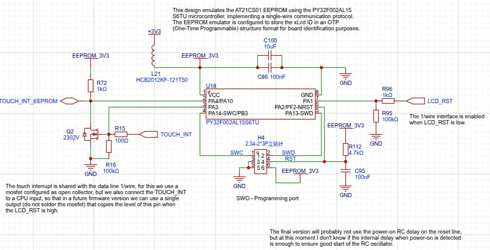
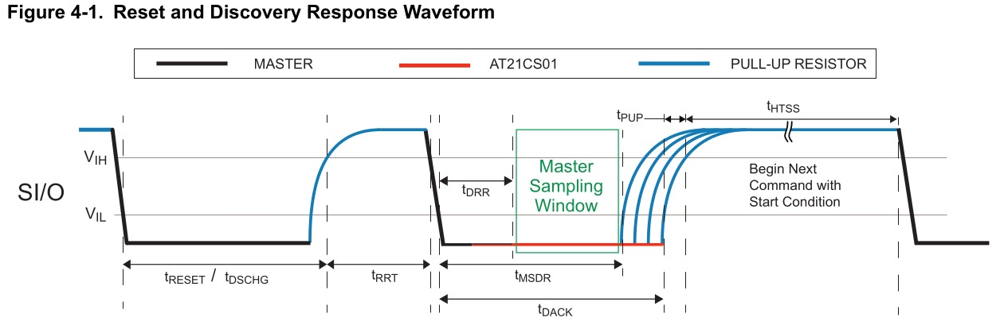
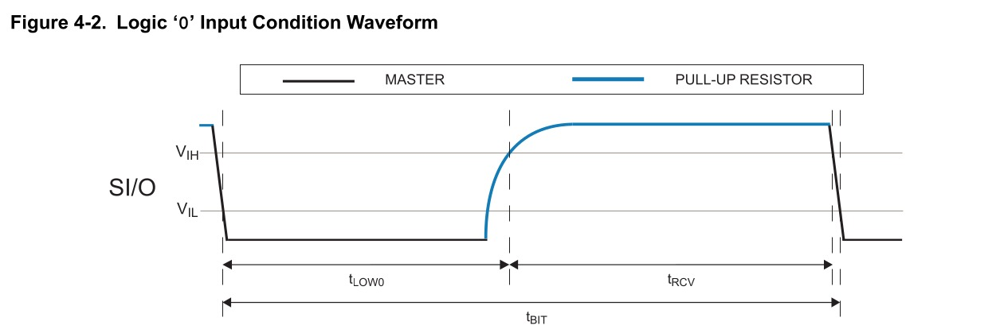
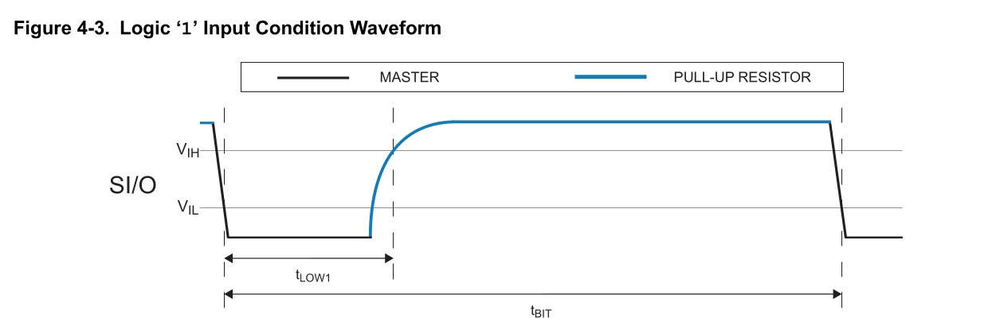
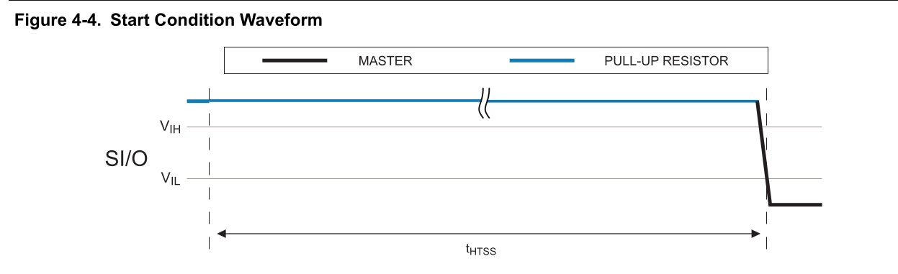
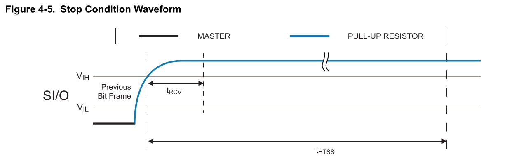

# AT21CS11 EEPROM Emulation on Puya PY32F0xx

This repository contains an **AT21CS11 EEPROM emulator over SWI (Single-Wire Interface)** implemented on the **Puya PY32F0xx** Cortex-M0+ microcontroller using **LL (Low Layer)** drivers.

It uses precise timing and GPIO polling to emulate the behavior of the original IC, responding to commands like manufacturer ID query and memory access. The internal EEPROM buffer persists across resets by placing it in a dedicated flash section that isn't erased during firmware updates.

🔗 [GitHub Repository](https://github.com/jjsch-dev/at21cs11-eeprom-emulator)

The project emulates basic commands like:
- EEPROM read/write
- Manufacturer ID query
- Start/stop condition detection for host communication
- ACK/NACK handling
- Bit-level timing control via polling and manual GPIO toggling

All global state transitions are handled in the main loop with precise µs-level timing to mimic the behavior of the original IC.

---

## 📦 Features

- ✅ Bit-banged SWI protocol implementation
- ✅ Supports command decoding for:
  - `OPCODE_MANUFACTURER_ID`
  - `OPCODE_EEPROM_ACCESS`
- ✅ ACK/NACK handling without external hardware
- ✅ Precise µs-level timing control using TIM1
- ✅ Optional UART logging via `ENABLE_UART_DEBUG`
- ✅ Debug pin support via `ENABLE_DEBUG_PIN`
- ✅ EEPROM data stored in last flash page to survive firmware updates
- ✅ No HAL or RTOS dependencies — minimal and fast

---

## 🖼️ Hardware Schematic

The following schematic illustrates the hardware connections for the AT21CS11 EEPROM emulator on the PY32F0xx microcontroller. This includes key components like the SWI interface, enable pin, debug pins, and pull-up resistors.



> **Note**: The final version may adjust some details (e.g., power-on RC delay), but this provides a clear overview of the current design.

---

## 🧰 Hardware Requirements

| Component         | Description |
|------------------|-------------|
| MCU              | Puya PY32F002 series (tested on SOP8 package) |
| Clock Source     | Internal HSI oscillator set to 24 MHz |
| SWI Pin          | PA10 (open-drain output) |
| Enable Pin       | PA1 (active-low input) |
| Debug GPIO (opt) | PA3 (toggled during bit transitions for tracing) |
| UART TX (opt)    | PA2 (for debug logging at 115200 bps) |
| SWCLK / SWC      | PA14 (SWD clock for flashing and debugging) |
| SWDIO / SWD      | PA13 (SWD data I/O for flashing and debugging) |
| Pull-up resistor | 1 kΩ on the SWI line |

> [!IMPORTANT]
> Last page of flash (e.g. `0x08004C00`) reserved for `eeprom_buffer`.

> ⚠️ Important: The host must follow the expected bit timing. This code does not currently adapt dynamically to varying speeds.

---

## 🛠 Software Requirements

This project assumes all development tools are placed under a local `toolchain/` directory inside your repo root:


This helps ensure consistent builds across different systems and avoids conflicts with system-wide installations.

---

### 1. ARM GCC Toolchain (arm-none-eabi-gcc)

Used to compile embedded C code for Cortex-M0+ architecture.

#### 🔽 Installation Steps:

1. **Download** the latest version of ARM GCC toolchain (`arm-none-eabi-gcc`):
   - [Arm GNU Toolchain Downloads](https://developer.arm.com/downloads/-/arm-gnu-toolchain-downloads)

2. **Verify** the download using SHA256 checksum:
   ```bash
   sha256sum -c arm-gnu-toolchain-*.tar.xz.sha256asc
   ```
3. **Extract** into the toolchain/gcc-arm/ folder
   ```bash
   mkdir -p toolchain/gcc-arm/
   tar -xvf arm-gnu-toolchain-*.tar.xz -C toolchain/gcc-arm/
   ```	
4. **Add** to PATH temporarily (for building):
   ```bash
   export PATH="$(pwd)/toolchain/gcc-arm/arm-gnu-toolchain-<version>-x86_64-arm-none-eabi/bin:$PATH"
   ```
> [!NOTE]
> Replace <version> with the actual extracted folder name.

5. **Verify** installation:
   ```bash
   arm-none-eabi-gcc --version
   ```
---

### 2. pyOCD (for flashing and debugging via SWD)

We use [pyOCD](https://pyocd.io/) to program the PY32F0xx microcontroller over SWD using an ST-Link or CMSIS-DAP programmer.

### 🧰 Install pyOCD Locally:

1. **Create** a virtual environment (recommended):
   ```bash
   python3 -m venv toolchain/pyocd/venv
   source toolchain/pyocd/venv/bin/activate
   ```
   
2. **Install** pyOCD in the virtual environment :
   ```bash
   echo 'source $(pwd)/toolchain/pyocd/venv/bin/activate' > toolchain/pyocd/activate.sh
   chmod +x toolchain/pyocd/activate.sh
   ```
---

### 3. Device Support for PY32F0xx
**pyOCD** does not natively support Puya PY32 MCUs, so we must provide a device pack file .

### 📦 Add PY32F0xx Support

1. **Download** the device family pack:

- From: [Keil Device Family Pack for PY32F0xx](https://www.keil.arm.com/packs/py32f0xx_dfp-puya/versions/)
- File used in this project: **Puya.PY32F0xx_DFP.1.1.0.pack**

2. **Place** it in the `toolchain/pyocd/` folder:
   ```bash
   cp Puya.PY32F0xx_DFP.1.1.0.pack toolchain/pyocd/
   ```
   
3. **Create** a pyocd.yaml configuration file in your project root:
   ```ymal
   pack:
     - ./toolchain/pyocd/Puya.PY32F0xx_DFP.1.1.0.pack 
   ```

4. **Use** the config when flashing :
   ```bash
   # Load firmware
   pyocd load ./swi_eeprom.hex -t py32f002ax5 --config ./pyocd.yaml

   # Erase chip
   pyocd erase --chip -t py32f002ax5 --config ./pyocd.yaml
   ```

> [!WARNING]
> Make sure the target name (py32f002ax5) matches your specific MCU variant.

---

### 4. Optional: Programmer Hardware

To flash and debug the device, you'll need an **SWD-compatible programmer**. This project has been tested using:

✅ **ST-Link V2 clone** (widely available and low-cost)  
Other supported options:
- CMSIS-DAP compatible debugger
- Black Magic Probe (alternative)

Ensure the following connections are made between the programmer and the PY32 MCU:

| Programmer Pin | Target MCU (PY32F0xx) |
|----------------|----------------------|
| SWCLK          | PA14                 |
| SWDIO          | PA13                 |
| GND            | GND                  |
| 3.3V (optional) | 3.3V               |

> [!NOTE]
> Some clones may require firmware updates to work reliably with non-STM32 devices like the Puya PY32 series.

---

## 📁 File Structure
    .
    ├── build                   	# Compiled files (ELF, HEX, BIN files)
    ├── docs                    	# Documentation folder 
    │ └── Microchip-AT21CS11.pdf 	# Official AT21CS11 Datasheet from Microchip
    ├── toolchain               	# Local tools installation (optional / project-specific)
    │ ├── gcc-arm/ 					# ARM GCC toolchain (arm-none-eabi-gcc)
    │ └── pyocd/	 				# pyOCD + config files for flashing via SWD
    ├── at21cs11_emulator.c     	# Core logic for SWI EEPROM emulation
    ├── debug.h / debug.c       	# Optional UART logging and debug pin support
    ├── eeprom_data.h           	# Declaration of EEPROM buffer and Manufacturer ID
    ├── Makefile / rules.mk     	# Build configuration and linker flags
    └── README.md               	# Project overview and instructions

---

## ⚙️ Configuration Options

| Macro                         | Description |
|-------------------------------|-------------|
| ENABLE_START_CONDITION_DETECT | Enables timeout-based start condition detection
| ENABLE_UART_DEBUG             | Enables UART-based logging via USART1
| ENABLE_DEBUG_PIN              | Toggles a debug GPIO pin during operation
| SWI_PIN                       | Set the BUS pin, by default LL_GPIO_PIN_10
| ENABLE_PIN                    | Set the enable pin, by default LL_GPIO_PIN_1
| DBG_PIN                       | Set the debug toggle pin, by default LL_GPIO_PIN_14

---

### 📑 Build & Flash Instructions

## 🛠 Build & Flash

1. **Clone the repository**

```bash
git clone https://github.com/jjsch-dev/at21cs11-eeprom-emulator.git
cd at21cs11-eeprom-emulator
```
2. **Build the project**

```bash
make
```
3. **Flash to the PY32F0xx device by SWD**

```bash
make flash
```

---

## 📝 SWI Protocol Overview

The **AT21CS01/11 EEPROM device** operates as a slave device using a **single-wire digital serial interface (SWI)** to communicate with a host controller. The protocol is designed for simplicity and efficiency, utilizing an 8-bit data structure where power is provided via the SI/O pin.

During communication, the state of the SI/O pin during specific time intervals determines the interpretation of data. Each bit frame transmits one data bit, and after eight bits (one byte), the receiving device must respond with either an **Acknowledge (ACK)** or **No Acknowledge (NACK)** response bit during a ninth bit window.

---

### 📊 Types of Data Transmitted Over the SI/O Line

The following types of data are transmitted over the single-wire interface:

1. **Reset and Discovery Response**
   - Used by the master to reset the device and perform a general bus call to determine if any devices are present on the bus.
   - **Waveform**: 

2. **Logic ‘0’ or Acknowledge (ACK)**
   - Indicates a logic '0' or an ACK response.
   - **Waveform**: 

3. **Logic ‘1’ or No Acknowledge (NACK)**
   - Indicates a logic '1' or a NACK response.
   - **Waveform**: 

4. **Start Condition**
   - Marks the beginning of a command sequence.
   - **Waveform**: 

5. **Stop Condition**
   - Marks the end of a command sequence.
   - **Waveform**: 

---

## 📚 Datasheet Reference

For full details on the **AT21CS11 EEPROM** and its **Single-Wire Interface (SWI)**, please refer to the official Microchip datasheet:

📄 [AT21CS11 Datasheet](docs/Microchip-AT21CS11.pdf)

This document includes:
- Full electrical specifications
- Timing diagrams for all communication states (reset, discovery, ACK/NACK, start/stop)
- Memory map and command set
- Power-up and security register behavior

> 💡 Tip: The timing thresholds used in this project (`THRESHOLD_RESET`, `THRESHOLD_BIT`, etc.) are derived from the timing diagrams in the datasheet. You may need to adjust them slightly depending on your host device's timing behavior.

---

### 📑 Known Limitations

## ⚠️ Known Limitations

- ❗ Polling-based design – could be improved with DMA or interrupts
- ❗ Only one device address supported
- ❗ EEPROM writes do not include checksum or persistence management
- ❗ Host timing must be predictable and match expected thresholds

---

## 🚀 Future Improvements (Ideas)

- [ ] Add adaptive bit timing calibration
- [ ] Improve EEPROM persistence with CRC or wear leveling
- [ ] Support for security register access
- [ ] Implement proper USART TX FIFO for non-blocking debug prints
- [ ] Add Python script for EEPROM image generation
- [ ] Provide STM32CubeIDE project structure

---

## 📜 License

[MIT License](LICENSE) – © jjsch-dev (2025)

You can freely use and modify this code as long as you include the original license.

## 🧑‍💻 Contributing

For contributions or improvements:
- Fork the project
- Create a new branch
- Submit a pull request

Or open issues or feature requests directly on the repository.

---

## 📬 Contact & Credits

- **Author**: jjsch-dev  
- **Repository**: [GitHub Link](https://github.com/jjsch-dev/at21cs11-eeprom-emulator)

---
