# AT21CS11 EEPROM Emulation on Puya PY32F0xx

This repository contains an **AT21CS11 EEPROM emulator over SWI (Single-Wire Interface)** implemented on the **Puya PY32F0xx** Cortex-M0+ microcontroller using **LL (Low Layer)** drivers.

It uses precise timing and GPIO polling to emulate the behavior of the original IC, responding to commands like manufacturer ID query and memory access. The internal EEPROM buffer persists across resets by placing it in a dedicated flash section that isn't erased during firmware updates.

🔗 [GitHub Repository](https://github.com/jjsch-dev/at21cs11-eeprom-emulator)

The project emulates basic commands like:
- EEPROM read/write
- Manufacturer ID query
- Start/stop condition detection for host communication
- ACK/NACK handling
- Bit-level timing control via polling and manual GPIO toggling

All global state transitions are handled in the main loop with precise µs-level timing to mimic the behavior of the original IC.

## 🖼️ Hardware Setup

The following image shows the physical implementation of the AT21CS11 EEPROM emulator on the PY32F0xx board:

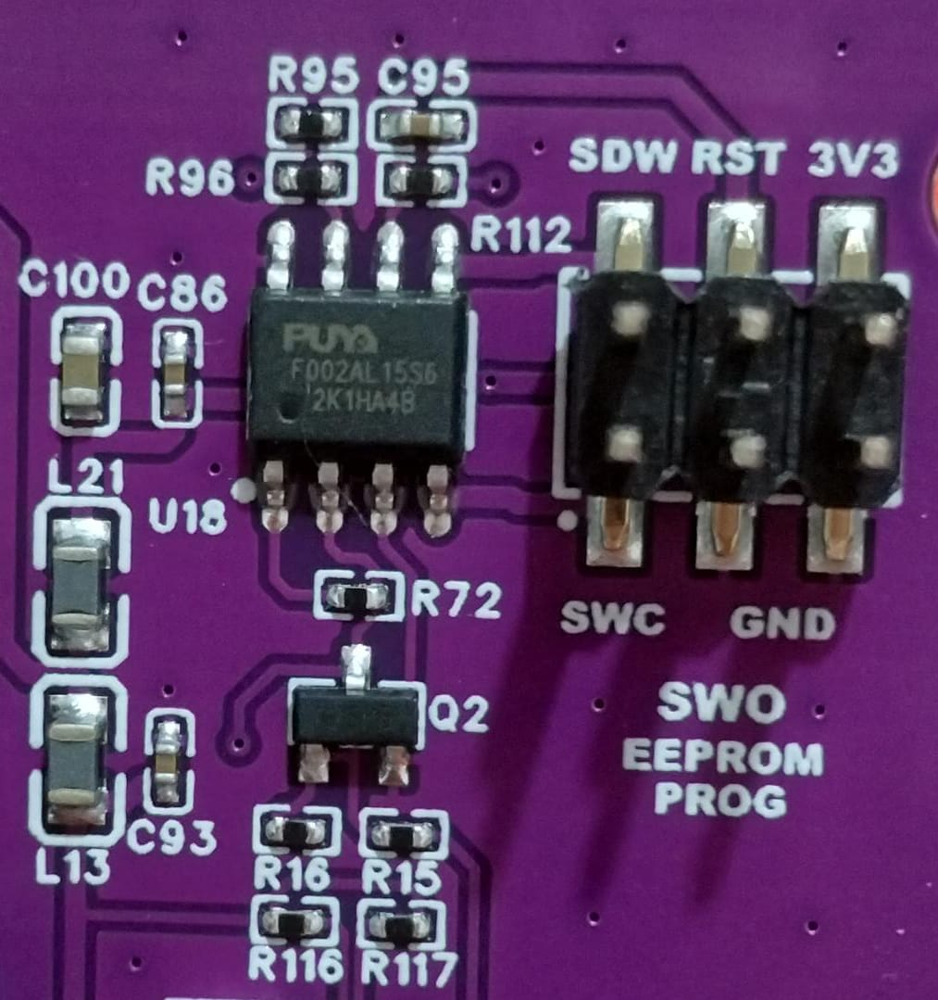

> 💡 Key components visible:
> - **PY32F002AL15S6T MCU**: Core processing unit
> - **SWD Pins**: SWCLK (SWC) and SWDIO (SWO) for debugging and flashing
> - **EEPROM Programming Header**: Used for programming the device
> - **Pull-up Resistors**: Ensures proper logic levels on critical pins

This setup demonstrates how the emulator is integrated into a real-world application.

---

## 📦 Features

- ✅ Bit-banged SWI protocol implementation
- ✅ Supports command decoding for:
  - `OPCODE_MANUFACTURER_ID`
  - `OPCODE_EEPROM_ACCESS`
- ✅ ACK/NACK handling without external hardware
- ✅ Precise µs-level timing control using TIM1
- ✅ Optional UART logging via `ENABLE_UART_DEBUG`
- ✅ Debug pin support via `ENABLE_DEBUG_PIN`
- ✅ EEPROM data stored in last flash page to survive firmware updates
- ✅ No HAL or RTOS dependencies — minimal and fast

---

## 🖼️ Hardware Schematic

The following schematic illustrates the hardware connections for the AT21CS11 EEPROM emulator on the PY32F0xx microcontroller. This includes key components like the SWI interface, enable pin, debug pins, and pull-up resistors.

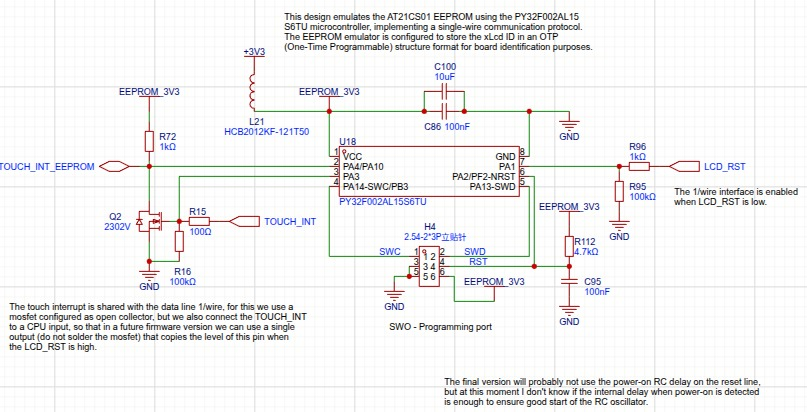

> **Note**: The final version may adjust some details (e.g., power-on RC delay), but this provides a clear overview of the current design.

---

## 🧰 Hardware Requirements

| Component         | Description |
|------------------|-------------|
| MCU              | Puya PY32F002 series (tested on SOP8 package) |
| Clock Source     | Internal HSI oscillator set to 24 MHz |
| SWI Pin          | PA10 (open-drain output) |
| Chip Select Pin  | PA1 (active-low input) |
| Debug GPIO (opt) | PA3 (toggled during bit transitions for tracing) |
| UART TX (opt)    | PA2 (for debug logging at 115200 bps) |
| SWCLK / SWC      | PA14 (SWD clock for flashing and debugging) |
| SWDIO / SWD      | PA13 (SWD data I/O for flashing and debugging) |
| Pull-up resistor | 1 kΩ on the SWI line |

> [!IMPORTANT]
> Last page of flash (e.g. `0x08004C00`) reserved for `eeprom_buffer`.

> ⚠️ Important: The host must follow the expected bit timing. This code does not currently adapt dynamically to varying speeds.

---

## 🛠 Software Requirements

This project assumes all development tools are placed under a local `toolchain/` directory inside your repo root:


This helps ensure consistent builds across different systems and avoids conflicts with system-wide installations.

---

### 1. ARM GCC Toolchain (arm-none-eabi-gcc)

Used to compile embedded C code for Cortex-M0+ architecture.

#### 🔽 Installation Steps:

1. **Download** the latest version of ARM GCC toolchain (`arm-none-eabi-gcc`):
   - [Arm GNU Toolchain Downloads](https://developer.arm.com/downloads/-/arm-gnu-toolchain-downloads)

2. **Verify** the download using SHA256 checksum:
   ```bash
   sha256sum -c arm-gnu-toolchain-*.tar.xz.sha256asc
   ```
3. **Extract** into the toolchain/gcc-arm/ folder
   ```bash
   mkdir -p toolchain/gcc-arm/
   tar -xvf arm-gnu-toolchain-*.tar.xz -C toolchain/gcc-arm/
   ```	
4. **Add** to PATH temporarily (for building):
   ```bash
   export PATH="$(pwd)/toolchain/gcc-arm/arm-gnu-toolchain-<version>-x86_64-arm-none-eabi/bin:$PATH"
   ```
> [!NOTE]
> Replace <version> with the actual extracted folder name.

5. **Verify** installation:
   ```bash
   arm-none-eabi-gcc --version
   ```
---

### 2. py32f0-template (PY32F0xx LL support library)

This project uses the [IOsetting/py32f0-template](https://github.com/IOsetting/py32f0-template) library to simplify register-level access to the PY32F0xx peripherals.

#### 🧩 Installation Steps

1. **Clone** or extract the library inside **toolchain/py32f0/**

   Option A: Clone via Git
   ```bash
   git clone https://github.com/IOsetting/py32f0-template.git toolchain/py32f0
   ```

   Option B: Download [ZIP](https://codeload.github.com/IOsetting/py32f0-template/zip/refs/heads/main) and extract
   ```bash
   unzip py32f0-template-main.zip -d toolchain/py32f0
   ```
   
2. **Include** path in Makefile
   ```bash
   LIB_ROOT := toolchain/py32f0/py32f0-template-main/
   ```
> [!NOTE]
> This project includes a tested version of the **py32f0-template** for reference only. It’s recommended to use the latest version from GitHub for bug fixes and improvements. 
   	
---

### 3. pyOCD (for flashing and debugging via SWD)

We use [pyOCD](https://pyocd.io/) to program the PY32F0xx microcontroller over SWD using an ST-Link or CMSIS-DAP programmer.

### 🧰 Install pyOCD Locally:

1. **Create** a virtual environment (recommended):
   ```bash
   python3 -m venv toolchain/pyocd/venv
   source toolchain/pyocd/venv/bin/activate
   ```
   
2. **Install** pyOCD in the virtual environment :
   ```bash
   pip install -U pyocd
   ```
---

### 4. Device Support for PY32F0xx
**pyOCD** does not natively support Puya PY32 MCUs, so we must provide a device pack file .

### 📦 Add PY32F0xx Support

1. **Download** the device family pack:

- From: [Keil Device Family Pack for PY32F0xx](https://www.keil.arm.com/packs/py32f0xx_dfp-puya/versions/)
- File used in this project: **Puya.PY32F0xx_DFP.1.1.0.pack**

2. **Place** it in the `toolchain/pyocd/` folder:
   ```bash
   cp Puya.PY32F0xx_DFP.1.1.0.pack toolchain/pyocd/
   ```
   
3. **Create** a pyocd.yaml configuration file in your project root:
   ```ymal
   pack:
     - ./toolchain/pyocd/Puya.PY32F0xx_DFP.1.1.0.pack 
   ```

4. **Use** the config when flashing :
   ```bash
   # Load firmware
   pyocd load ./swi_eeprom.hex -t py32f002ax5 --config ./pyocd.yaml

   # Erase chip
   pyocd erase --chip -t py32f002ax5 --config ./pyocd.yaml
   ```

> [!WARNING]
> Make sure the target name (py32f002ax5) matches your specific MCU variant.

---

### 5. Optional: Programmer Hardware

To flash and debug the PY32F0xx microcontroller, an **SWD-compatible programmer** is required. The following image shows the ST-Link V2 programmer connected to the target board via a 10-pin connector.

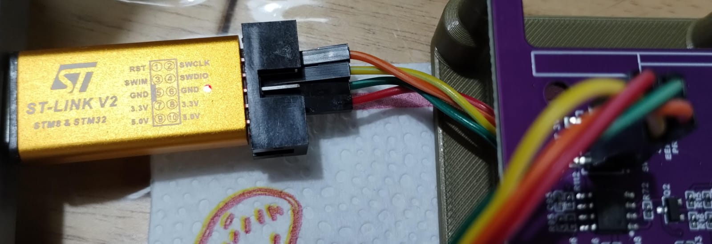

✅ **ST-Link V2 clone** (widely available and low-cost)  

Other supported options:
- CMSIS-DAP compatible debugger
- Black Magic Probe (alternative)

Ensure the following connections are made between the programmer and the PY32 MCU:

| Programmer Pin | Target MCU (PY32F0xx) |
|----------------|----------------------|
| SWCLK          | PA14                 |
| SWDIO          | PA13                 |
| GND            | GND                  |
| 3.3V (optional) | 3.3V               |

> [!NOTE]
> Some clones may require firmware updates to work reliably with non-STM32 devices like the Puya PY32 series.

---

## 📁 File Structure
    .
    ├── build                   	                # Compiled files (ELF, HEX, BIN files)
    ├── docs                    	                # Documentation folder 
    │ ├── Microchip-AT21CS11.pdf 	                # Official AT21CS11 Datasheet from Microchip
    │ ├── PY32F002A_Reference_manual_ v1.0_EN.pdf 	# Reference Manual for Puya PY32F002A
    │ ├── PY32F002A_datasheet_Rev.0.2_EN.pdf        # Datasheet for PY32F002A
    │ └── PY32L020_Datasheet_V1.0.pdf               # Datasheet for faster PY32L0xx series
    ├── toolchain               	                # Local tools installation (optional / project-specific)
    │ ├── gcc-arm                                   # ARM GCC toolchain (arm-none-eabi-gcc)
    │ ├── py32f0                                    # PY32F0xx LL support library (py32f0-template)
    │ ├── pyocd                                     # pyOCD + config files for flashing via SWD
    │ └── scripts                                   # Write/read Python scripts to modify CPU fuses
    ├── at21cs11_emulator.c     	                # Core logic for SWI EEPROM emulation
    ├── debug.h / debug.c       	                # Optional UART logging and debug pin support
    ├── eeprom_data.h           	                # Declaration of EEPROM buffer and Manufacturer ID
    ├── Makefile / rules.mk     	                # Build configuration and linker flags
    └── README.md               	                # Project overview and instructions

---

## ⚙️ Configuration Options

| Macro                         | Description |
|-------------------------------|-------------|
| ENABLE_START_CONDITION_DETECT | Enables timeout-based start condition detection
| ENABLE_EEPROM_CS_PIN          | Enables the EEPROM chip select pin
| ENABLE_UART_DEBUG             | Enables UART-based logging via USART1
| ENABLE_DEBUG_PIN              | Toggles a debug GPIO pin during operation
| SWI_PIN                       | Set the BUS pin, by default LL_GPIO_PIN_10
| NCS_PIN                       | Set the negative chip select pin, by default LL_GPIO_PIN_1
| DBG_PIN                       | Set the debug toggle pin, by default LL_GPIO_PIN_14
| UART_TX_PIN                   | Set the UART TX pin for log, default LL_GPIO_PIN_2

---

### 📑 Build & Flash Instructions

## 🛠 Build & Flash

1. **Clone the repository**

```bash
git clone https://github.com/jjsch-dev/at21cs11-eeprom-emulator.git
cd at21cs11-eeprom-emulator
```
2. **Build the project**

```bash
make
```
3. **Flash to the PY32F0xx device by SWD**

```bash
make flash
```
---
### 📡 Enabling USART Debugging via GPIO Repurposing

To enable **USART debugging** on the PY32F0xx microcontroller, you need to repurpose **Pin 8 (NRST)** from its default **RESET** function to a **GPIO**. This is achieved by modifying the Option Bytes of the device. Below is a step-by-step guide to configure the microcontroller and enable USART debugging.

1. **⚙️ Understanding the Default Configuration**
By default, Pin 8 (NRST) is configured as the RESET pin. To use it as a GPIO for USART debugging, you must change its function via the Option Bytes.

**Default Option Byte Output (Before Modification)**
```bash
python3 ../scripts/puya_read_option_byte.py

Raw Option-bytes word: 0x4155BEAA

→ Read-Protection (RDP):
    level 0 (inactive), byte=0xAA

→ Brown-Out Reset (BOR):
    enabled: False
    threshold: 3.2 V↑ / 3.1 V↓

→ Independent WDG:
    mode: SW (SW=software, HW=hardware)

→ NRST pin:
    function: RESET

→ nBOOT1:
    boot area: System-mem

→ Complement bytes:
    nRDP:  0x55
    nUSER: 0x41
```
2.  **✍️ Modifying the Option Bytes**
    To repurpose Pin 8 (NRST) as a GPIO, you need to write the Option Bytes using the `puya_write_option_byte.py` script.

    > **⚠️ CAUTION:** This operation can crash the CPU if done incorrectly, so proceed with caution.
    
#### 🧩 Step-by-Step Instructions:

1.  **🚀 Activate** the Virtual Environment:
    Ensure you have `pyOCD` installed in a virtual environment. Activate it before running the scripts:

    ```bash
    source toolchain/pyocd/venv/bin/activate
    ```

2.  **🔍 Read** the Current Option Bytes:
    Before making changes, verify the current configuration:

    ```bash
    python3 ../scripts/puya_read_option_byte.py
    ```

3.  **💾 Write** the New Option Bytes:
    Use the `puya_write_option_byte.py` script with the `--nrst_mode 1` flag to change the NRST pin function to GPIO:

    ```bash
    python3 ../scripts/puya_write_option_byte.py --nrst_mode 1
    ```

    Output:

    ```bash
    Programming lower 16-bit option value: 0xFEAA
    Live FLASH_OPTR before programming: 0x0000FEAA
    Stored option bytes before programming (raw): 0x4155BEAA
    Unlocking FLASH_CR...
    Option bytes are locked; performing OPTKEY unlock sequence...
    Option bytes unlocked successfully.
    Writing option bytes value: 0xFEAA
    Triggering option byte programming...
    Option bytes programming sequence complete.
    Resetting device to reload option bytes...
    Live FLASH_OPTR after programming: 0x0000FEAA
    Stored option bytes after programming (raw): 0x0155FEAA
    Done.
    ```

4.  **✅ Verify** the Change:
    After writing the new option bytes, read them again to confirm the `NRST` pin is now configured as `GPIO`:

    ```bash
    python3 ../scripts/puya_read_option_byte.py
    ```

    Output:

    ```bash
    Raw Option-bytes word: 0x0155FEAA

    → Read-Protection (RDP):
        level 0 (inactive), byte=0xAA

    → Brown-Out Reset (BOR):
        enabled: False
        threshold: 3.2 V↑ / 3.1 V↓

    → Independent WDG:
        mode: SW (SW=software, HW=hardware)

    → NRST pin:
        function: GPIO

    → nBOOT1:
        boot area: System-mem

    → Complement bytes:
        nRDP:  0x55
        nUSER: 0x01
    ```

3.  **💻 Enabling USART Debugging in Code**
    Once the NRST pin is repurposed as GPIO, you can enable USART debugging by modifying the `debug.h` file:

    1.  **✏️ Enable** USART Debugging:
        Change the `ENABLE_UART_DEBUG` macro from `#undef` to `#define` in `debug.h`:

        ```c
        #define ENABLE_UART_DEBUG
        ```

    2.  **🛠️ Recompile** the Code:
        Recompile the project to include USART debugging:

        ```bash
        make
        ```

        Output:

        ```bash
        Memory region        Used Size    Region Size   %age Used
               RAM:        1432 B           3 KB        46.61%
             FLASH:        6012 B          20 KB        29.36%
        OBJCP BIN    Build/swi_eeprom.bin
        ```

    3.  **🔥 Update** the Firmware:
        Flash the updated firmware to the PY32F0xx device using `pyOCD`:

        ```bash
        make flash
        ```

        Output:

        ```bash
        toolchain/pyocd/myenv/bin/pyocd erase -t py32f002ax5 --chip --config ./toolchain/pyocd/pyocd.yaml
        Waiting for a debug probe to be connected...
        0006642 I Erasing chip... [eraser]
        0006965 I Chip erase complete [eraser]
        toolchain/pyocd/myenv/bin/pyocd load Build/swi_eeprom.elf -t py32f002ax5 --config ./toolchain/pyocd/pyocd.yaml
        0000310 I Loading /home/jjsch/3d_printer/prusa_original/rmx35/xlcd/eeprom/source/swi_eeprom_ll/Build/swi_eeprom.elf [load_cmd]
        [==================================================] 100%
        0001423 I Erased 12288 bytes (3 sectors), programmed 6144 bytes (48 pages), skipped 0 bytes (0 pages) at 5.40 kB/s [loader]
        ```

4.  **🔌 Connecting the USB TTL Adapter**
    To view debug messages, connect a **TTL to USB converter** (compatible with 3.3 V) to the PY32F0xx board:

    Connect :

      - TTL TX → Pin 8 (NRST/GPIO)
      - TTL GND → GND

    Configure the Serial Terminal :

      - Open a serial terminal (e.g., PuTTY, Tera Term, CoolTerm).
      - Set the baud rate to 115200.
      - Ensure no flow control is enabled.

### 📸 Debug Setup Visual

For a clearer understanding of the hardware connections, refer to the image below:

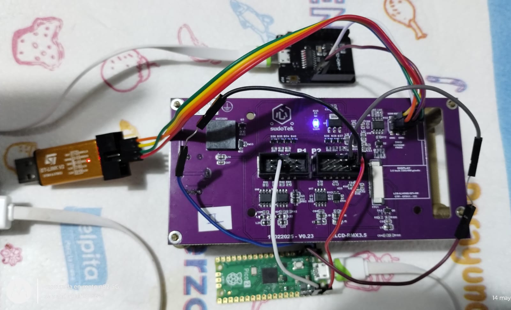

*This image shows the PY32F0xx development board connected to an ST-Link programmer and a USB-to-TTL adapter. The wiring for the serial communication (TTL TX to Pin 8/NRST and TTL GND to GND) is clearly visible.*

5.  **🧪 Testing USART Debugging**

    1.  **⚡ Power On** the Board:
        When the board powers on, you should see the following message in the serial terminal:

        ```plaintext
        AT21CS11 emulation start
        ```

    2.  **➡️ Send** a Discovery Reset:
        When the host sends a discovery reset, the debug output will show:

        ```plaintext
        reset: 150 us
        ```

#### 🚨 Important Notes

  - **⚠️ Risk of CPU Crash**: Modifying Option Bytes can brick the device if done incorrectly. Always back up your work and verify changes.
  - **🔄 Power Cycles**: After modifying Option Bytes, power cycle the device to ensure the new configuration takes effect.
  - **📌 GPIO Pin Usage**: Ensure that repurposing the NRST pin as GPIO does not conflict with other critical functions in your application.

#### 📝 Example Debug Output

When enabled, the USART debug output will provide real-time insights into the emulator's state, such as:

  - Start conditions
  - Command decoding
  - Timing measurements
  - State transitions

---

### ⏱️ Debugging with GPIO Pin Toggling for Timing Analysis

This section explains how to utilize a dedicated GPIO pin to measure the timing of specific software events or code sections using an oscilloscope. By toggling a designated pin at the start and end of a code block or during a particular event, you can visually analyze the duration and synchronization on an oscilloscope. This is particularly useful for understanding the timing of the SWI bus or the execution time of CPU-intensive tasks.

**Hardware Setup:**

To use this debugging method, you will need an oscilloscope 🔬 connected to the designated debug pin on your PY32F0xx board. The specific pin used for this purpose is defined by the `DBG_PIN` macro (e.g., GPIO 1) in your project's configuration. You might also connect another channel of your oscilloscope to the SWI bus pin to observe its behavior in relation to the debug toggles.

**(Example Setup - See Image Below):**

The image below shows an example hardware setup with oscilloscope probes connected to the SWI bus pin (Channel 1 - Yellow) and the debug toggle pin (Channel 2 - Blue).

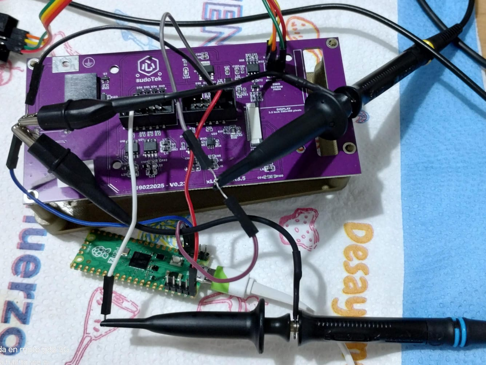

**Software Configuration:**

To enable this debugging feature, you need to make the following modifications in your code:

1.  **🚫 Disable EEPROM Chip Select (if using the NCS pin for debug):**
    If you intend to use the same pin that is normally used for the EEPROM Chip Select (`NCS_PIN`) as your debug toggle pin, you **must** disable the EEPROM functionality by commenting out or undefining the `ENABLE_EEPROM_CS_PIN` macro. This prevents conflicts with the EEPROM emulation.

    ```c
    #undef ENABLE_EEPROM_CS_PIN
    ```

2.  **✅ Enable Debug Pin Toggling:**
    Enable the debug pin toggling feature by defining the `ENABLE_DEBUG_PIN` macro in your project's configuration (e.g., in a `config.h` or `debug.h` file).

    ```c
    #define ENABLE_DEBUG_PIN
    ```

3.  **💻 Using the `debug_toggle_pin()` Macro (Example: Reset and Discovery):**
    The following code snippets illustrate how `debug_toggle_pin()` is used to mark key events during the reset and discovery phase on the SWI bus:

    ```c
    // In the SWI bus handling logic:

    // If we detect a low pulse > THRESHOLD_RESET => Enter STATE_RESET
    if (pulse_duration > THRESHOLD_RESET) {
        swi_state = STATE_RESET;
        // ... other reset state updates ...
        debug_log("reset: %lu us\r\n", pulse_duration);
        debug_toggle_pin(); // 🟦 First toggle: Reset detected
        return;
    }

    // ... later in the SWI bus handling, after acknowledging the reset:

    if (send_logic_0) {
        LL_GPIO_ResetOutputPin(SWI_GPIO_Port, SWI_PIN);
        delay_us(MIN_LOW_PULSE);
        LL_GPIO_SetOutputPin(SWI_GPIO_Port, SWI_PIN);
        debug_toggle_pin(); // 🟦 Second toggle: SWI pin pulled low to ACK reset
        // ... other actions ...
    }
    ```

**Interpreting the Oscilloscope Capture (See Image Below):**

The oscilloscope capture below shows the SWI bus signal (Channel 1 - Yellow) and the debug toggle pin (Channel 2 - Blue) during a reset and discovery sequence.

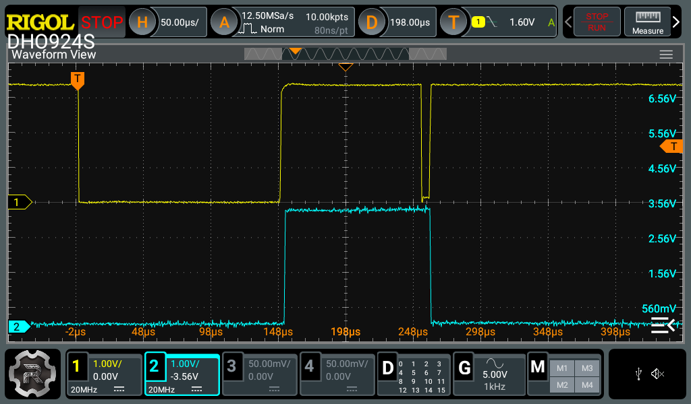

* The **yellow trace (Channel 1)** shows the activity on the SWI bus. You can observe the initial low pulse that triggers the reset detection.
* The **blue trace (Channel 2)** shows the toggles of the debug pin (GPIO 1):
    * The **first rising or falling edge** on the blue trace corresponds to the `debug_toggle_pin()` call when the reset condition is detected in the code.
    * The **second rising or falling edge** on the blue trace corresponds to the `debug_toggle_pin()` call when the firmware pulls the SWI pin low to acknowledge the reset.

By using the timebase of the oscilloscope, you can measure the time elapsed between these two debug pin toggles, giving you insight into the duration of the code execution and the SWI bus activity during this phase. You can also correlate the debug pin toggles with specific events on the SWI bus signal.

**⚠️ Important Considerations:**

* **📌 Pin Conflicts:** Be extremely careful when using the `NCS_PIN` for debugging. Ensure that `ENABLE_EEPROM_CS_PIN` is **undefined** to avoid unintended interactions with the EEPROM emulation.
* **⚙️ Macro Availability:** The `debug_toggle_pin()` macro will only be available in your code if the `ENABLE_DEBUG_PIN` macro is defined. You might need to include a specific header file where this macro is defined.
* **⏳ Performance Impact:** Inserting `debug_toggle_pin()` calls will introduce a small overhead in your code execution time. This is generally acceptable for debugging purposes but should be considered if you are performing very precise timing measurements. Remember to remove or comment out these calls in your final production code.

This example demonstrates how you can use a dedicated debug pin and an oscilloscope to gain detailed timing information about specific parts of your software and its interaction with external buses like the SWI bus.

---

### 📝 SWI Protocol Overview

The **AT21CS01/11 EEPROM device** operates as a slave device using a **single-wire digital serial interface (SWI)** to communicate with a host controller. The protocol is designed for simplicity and efficiency, utilizing an 8-bit data structure where power is provided via the SI/O pin.

During communication, the state of the SI/O pin during specific time intervals determines the interpretation of data. Each bit frame transmits one data bit, and after eight bits (one byte), the receiving device must respond with either an **Acknowledge (ACK)** or **No Acknowledge (NACK)** response bit during a ninth bit window.

---

### 📊 Types of Data Transmitted Over the SI/O Line

The following types of data are transmitted over the single-wire interface:

1. **Reset and Discovery Response**
   - Used by the master to reset the device and perform a general bus call to determine if any devices are present on the bus.
   - **Waveform**: 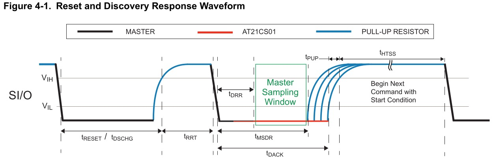

2. **Logic ‘0’ or Acknowledge (ACK)**
   - Indicates a logic '0' or an ACK response.
   - **Waveform**: 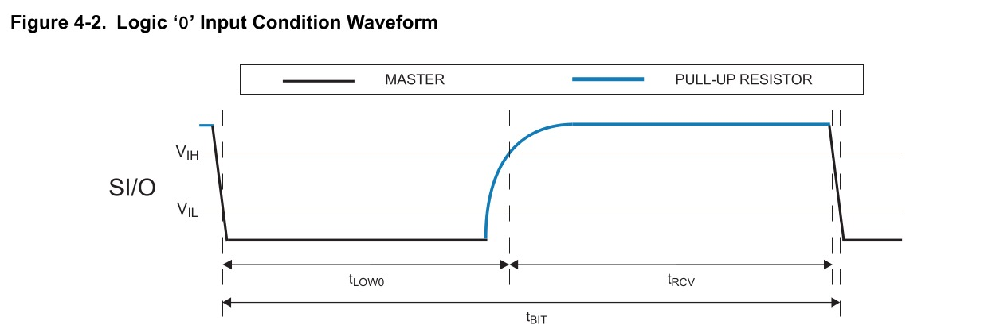

3. **Logic ‘1’ or No Acknowledge (NACK)**
   - Indicates a logic '1' or a NACK response.
   - **Waveform**: 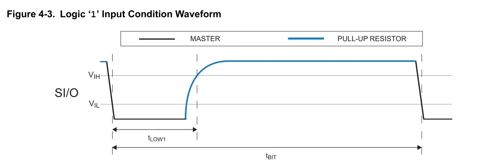

4. **Start Condition**
   - Marks the beginning of a command sequence.
   - **Waveform**: 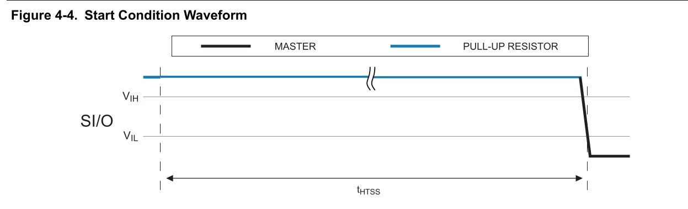

5. **Stop Condition**
   - Marks the end of a command sequence.
   - **Waveform**: 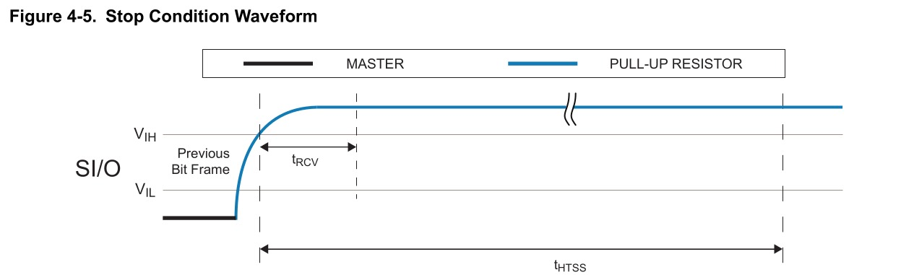

---

## 🧠 Microcontroller Overview: PUYA PY32F002AL15S6TU

The **PUYA PY32F002AL15S6TU** is a low-cost, 32-bit ARM® Cortex®-M0+ microcontroller in an SOP-8 package. It provides all the necessary features to emulate the AT21CS11 EEPROM over a single-wire interface using bit-banged GPIO and precise timing control.

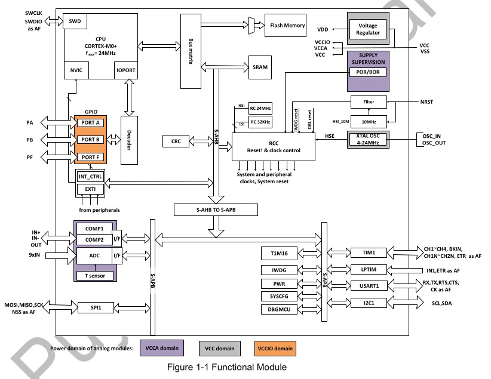

This diagram illustrates how the various peripherals are interconnected.

### 🔍 Key Features

| Feature               | Specification |
|-----------------------|---------------|
| **Core**              | ARM Cortex-M0+ @ up to 24 MHz |
| **Flash Memory**      | 20 KB (enough to store firmware + emulated EEPROM) |
| **RAM**               | 3 KB SRAM |
| **GPIO**              | Configurable open-drain pins with internal pull-ups |
| **Timers**            | Two 16-bit timers for sub-microsecond edge detection and pulse generation |
| **Communication**     | USART, SPI, I²C interfaces |
| **ADC & Comparators** | 12-bit ADC, 2 comparators (not used in this project) |
| **Voltage Range**     | 1.7 V – 5.5 V |
| **Temperature Range** | -40 °C to +85 °C |
| **Low-Power Modes**  | Sleep and Stop modes supported |

> 📦 [Official Datasheet](docs/PY32F002A_datasheet_Rev.0.2_EN.pdf)

---

### ✅ Why This MCU Is Ideal for EEPROM Emulation

- **Accurate Bit-Bang Timing**:  
  The dual 16-bit timers and deterministic Cortex-M0+ instruction timing allow sub-microsecond delays required by the AT21CS11 protocol.

- **Open-Drain GPIO Support**:  
  Dynamic switching between input (high impedance) and output modes with internal pull-ups matches the single-wire, open-drain requirements of SWI communication.

- **Sufficient Flash & RAM**:  
  With 20 KB Flash and 3 KB SRAM, the chip comfortably supports:
  - Bit-banged SWI logic
  - Timer-based edge detection
  - Optional debug logging
  - Persistent memory emulation in flash

- **Robust Communication Peripherals**:  
  Built-in USART, SPI, and I²C are useful for debugging or future expansions (e.g., capturing external EEPROM signals).

- **Cost-Effective & Compact**:  
  At under $0.10 in volume and housed in a small SOP-8 package, it’s ideal for prototyping or high-volume deployments.

By leveraging its precise timers, flexible GPIO, and ample memory, the PY32F002AL15S6TU becomes a highly capable platform for emulating an AT21CS11 EEPROM entirely in software.

---
## 📚 Datasheet Reference

For full details on the **AT21CS11 EEPROM** and its **Single-Wire Interface (SWI)**, please refer to the official Microchip datasheet:

📄 [AT21CS11 Datasheet](docs/Microchip-AT21CS11.pdf)

This document includes:
- Full electrical specifications
- Timing diagrams for all communication states (reset, discovery, ACK/NACK, start/stop)
- Memory map and command set
- Power-up and security register behavior

> 💡 Tip: The timing thresholds used in this project (`THRESHOLD_RESET`, `THRESHOLD_BIT`, etc.) are derived from the timing diagrams in the datasheet. You may need to adjust them slightly depending on your host device's timing behavior.

---

### 📑 Known Limitations

## ⚠️ Known Limitations

This implementation has several limitations that are important to understand before using or extending the project:

- ❗ **Polling-based design** – Polling is used instead of IRQ-based edge detection in timing-critical sections.  
  This avoids the latency and stack overhead associated with interrupt handling, ensuring fast response to host signals.  
  However, the time consumed by processing logic (approx **1.3 µs**) leaves little room to add more features or complex logic.  
  Using a faster CPU like the **[PY32L020](docs/PY32L020_Datasheet_V1.0.pdf)** running at **48 MHz** could improve performance,  
  though note that **Flash access at 48 MHz adds a wait state**, so clock configuration must be optimized accordingly.
  
- ❗ **Start Condition Detection Strategy** – Start condition detection relies on a timer interrupt (TIM1 CC2), which triggers if no edge is detected within `TIMEOUT_START_US`.  
  For simplicity and to avoid extra checks during time-critical polling, the timer is reset on *every* edge detection without verifying the level of the SWI line.  
  This may result in less accurate start condition handling if the host's timing deviates from expectations.

- ❗ **EEPROM write command not implemented** – While read operations work, the EEPROM write command is not yet supported.  
  This limits full bidirectional communication with the host until implemented.

- ❗ **Timing sensitivity and synchronization** – Host communication must follow expected bit timing precisely.  
  The current design sends logic '0' on the falling edge to reduce response delay. However, this causes the bit counter to advance before the host’s ACK/NACK is received.  
  If not handled properly, this can lead to misalignment with the host and data errors during transmission.

- ❗ **Chip Enable Signal Handling** – An external interrupt (`EXTI0_1_IRQHandler`) is used to detect when the `CHIP_ENABLE_PIN` goes high, reducing CPU usage by avoiding constant polling.  
  When the host re-enables the chip (pin goes low), execution resumes from wherever the loop was paused.  
  This means the emulator may resume operation mid-bit-time with outdated state variables (e.g., `swi_state`, `bit_count`, etc.), leading to potential synchronization issues.
    
---

## 🚀 Future Improvements (Ideas)

- [ ] Add adaptive bit timing calibration
- [ ] Improve EEPROM persistence with CRC or wear leveling
- [ ] Support for security register access
- [ ] Implement proper USART TX FIFO for non-blocking debug prints
- [ ] Add Python script for EEPROM image generation
- [ ] Provide STM32CubeIDE project structure

---

## 📜 License

[MIT License](LICENSE) – © jjsch-dev (2025)

You can freely use and modify this code as long as you include the original license.

## 🧑‍💻 Contributing

For contributions or improvements:
- Fork the project
- Create a new branch
- Submit a pull request

Or open issues or feature requests directly on the repository.

---

## 📬 Contact & Credits

- **Author**: jjsch-dev  
- **Repository**: [GitHub Link](https://github.com/jjsch-dev/at21cs11-eeprom-emulator)

---
